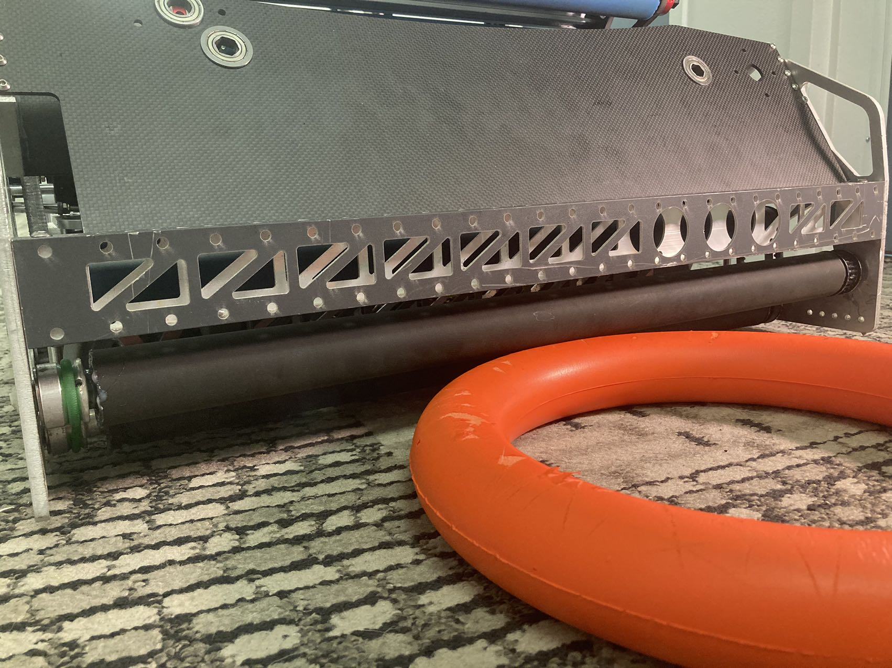
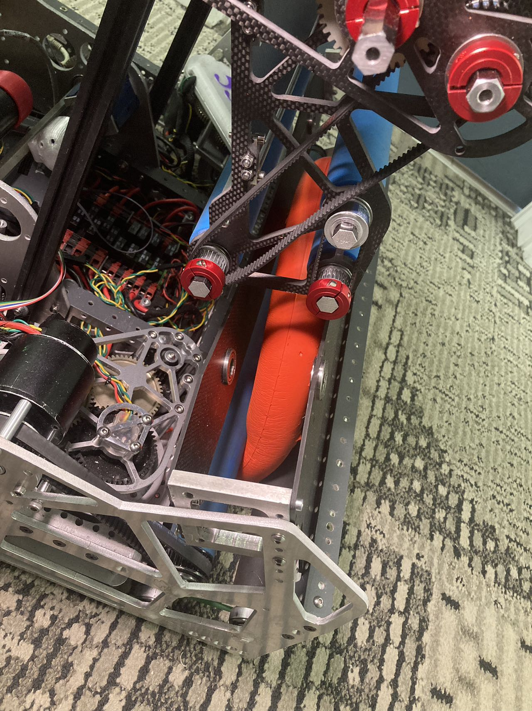
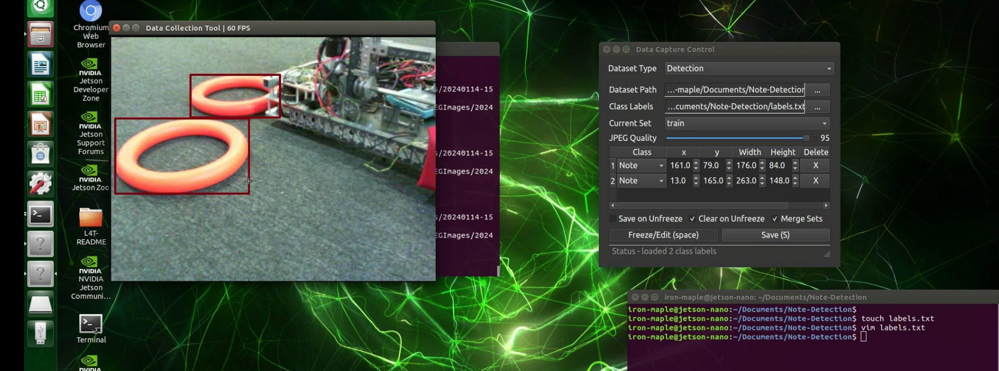
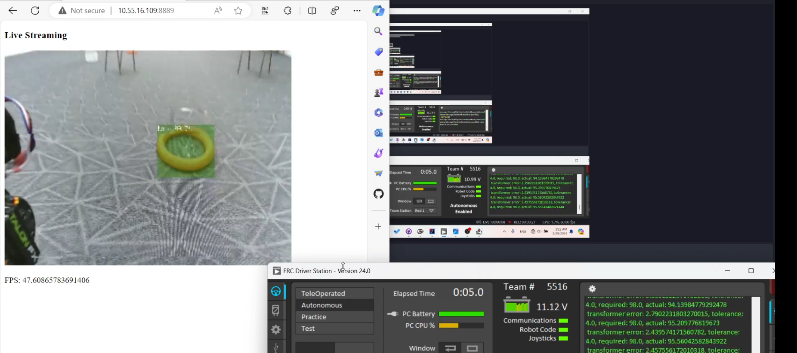
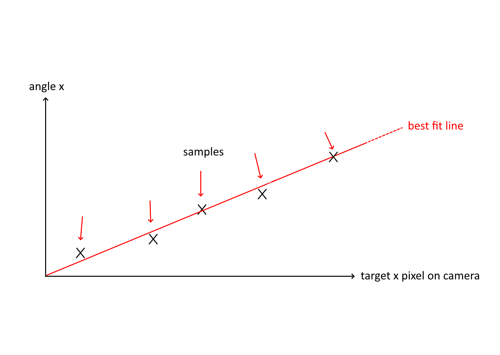

# TEAM 6706 Competition Robot *"PHANTOM"* Ⅱ

Team 5516 **IRON MAPLE** and Team 6706 **Golem**, presents.
***

## Overview
This year, our team has formed an alliance with Team 5516 "Iron Maple" in our city.  Together we have designed, built and programmed the Robot "PHANTOM", which is used by Team 5516 in Canadian Pacific Regional.  The Robot we use is "PHANTOM" Ⅱ, the upgraded version of "PHANTOM".  

    
    

    

"PHANTOM" Ⅰ

    

"PHANTOM" Ⅱ

Extending our work on "PHANTOM", "PHANTOM" Ⅱ continues to showcase its autonomous capabilities, employing a suite of sensors and algorithms to independently execute most field tasks. This portfolio concentrates on the development of these autopilot functions, briefly touching on other aspects, with detailed discussions available in *the annexes*.

## Hardware Components (in brief)
"PHANTOM" features a custom-designed, square-shaped chassis with four advanced swerve modules, optimized for easy transportation.

At the rear, a feeder equipped with rollers collects Notes from the ground, directing them to the intake and shoot module.

The intake & shoot module, mounted on an arm, performs three functions: grabbing Notes from the feeder, shooting Notes to the "Speaker," and directing them to the amplifier when positioned vertically.

    
    

    
    

A key innovation is our robot's modular design, allowing for disassembly into four parts for convenient transport and reassembly within three hours—a crucial feature for overseas competitions.

## Self-Developed Swerve Drive Library (in brief)
Despite the availability of official FRC swerve drive code, we encountered limitations in performance and reliability. Our team invested four months in developing a superior swerve drive library, featuring enhancements in wheel direction control, power constraints, dynamic steering, acceleration control, and more. This custom library has been validated not only by our team but also by peers, demonstrating its superior performance without additional costs.

In comparison to WPILib, our code is improved in the following ways:
    1. Smart Wheel Direction Control
    2. Wheel Power Constrain
    3. Dynamic Steering PID
    4. Chassis Acceleration Constrain
    5. Curve-Based Position Estimator
    6. XML-based robot configurator
    7. Enhanced Controller Stick Dead-Banding and Stick Value Curves
    8. Enhanced Path-Planning with Speed Curves 
    9. Delay-Compensation for Auto-Stage-Path-Follwing
    10. Self-Instructed Autonomous program
Each of these improvements are small and hard to notice, but combined, they do make a difference. The  Our swerve-drive-lib is considered better not only by our pilots, but also by Team 6414 "Voyager" and Team 8812 "SCIE" from ShenZhen, who have choosen our swerve lib over WpiLib.  Technical details for all the above can be found in *the annexes*.

## On-Bot Computer Vision System
The initial step in developing the autonomous driving functionality, naturally, involves enabling the robot to perceive its surroundings. To achieve this, we opted for a wholly self-developed system, preferring it over the default solution provided by WPI.

#### Hardware Setups
The core of our vision system is the "Jetson Nano" AI micro-computer, which, while comparable to the Raspberry Pi utilized in WPILib's On-Bot Computer Vision, distinguishes itself with a high-performance Neural Processing Unit (NPU) capable of handling complex AI-driven vision tasks. This setup includes two strategically placed cameras: one facing forward to determine the positions of Navigation Tags on both the Speaker and Amplifier, and another facing rearward to detect the GamePiece, ensuring comprehensive coverage of critical game elements.

    
    

#### GamePieces Detection through AI-DetectNet

To accurately identify GamePieces, we amassed a dataset from our playing field to train a bespoke AI object-detection network. This approach significantly surpasses the capabilities of the OpenCV-based solutions provided by WPILib, which primarily detect GamePieces based on color. Our vision network excels in both accuracy and reliability by recognizing GamePieces through their distinct shapes and appearances, making it robust against variations in lighting conditions and immune to confusion with similarly colored objects.

In comparison to OpenCV applications that WPILib provided, which recognizes the GamePiece mainly by its color, our Vision Network stands out for its accuracy and reliability. Since the AI-model recoginizes the GamePiece by its unique shape and appearance, it is not dependent to lighting environment and will not confound the target with objects with similar colors. 

#### Hardware-Accelerated AprilTags Detection

Our system's detection of AprilTags, the navigational markers used on the field, is enhanced with GPU acceleration, leveraging the open-source project by NVIDIA available at [Isaac ROS AprilTag](https://github.com/NVIDIA-AI-IOT/isaac_ros_apriltag). Unlike the OpenCV-based AprilTag detection offered by WPILib, which operates at 30fps and consumes significant CPU resources on the Raspberry Pi, our implementation achieves up to 90fps with minimal CPU load, courtesy of the advanced AI Micro-Processor. This efficiency gain not only improves performance but also frees up resources for other computational tasks.

#### Communicating with robotRIO

To facilitate communication with the robotRIO, we connect the vision co-processor using Ethernet. A custom Python application we developed sends the detection results continuously to a web server. Our robot's code, written in Java, retrieves these results from the server at a rate of 60 times per second, ensuring timely and efficient data transfer.

Additionally, the server broadcasts the images to a webpage, enabling us to monitor the detection outcomes in real-time on a computer during testing and practice sessions. This setup not only enhances our ability to fine-tune the system's performance but also provides immediate visual feedback, crucial for rapid development and troubleshooting.

#### Calculating Precise Target Positions
Beyond merely detecting Notes/AprilTags, our system is adept at calculating the precise relative position between the robot and its targets. This capability hinges on knowing the field of view (FOV), the camera's height, and its pitch angle. With these parameters, we employ trigonometry to accurately determine relative positioning, as illustrated.

    
    

However, manually measuring these parameters can be challenging and prone to inaccuracies. Our approach ensures precision in positioning, crucial for effective navigation and interaction with game elements.

#### Camera Auto-Calibration Process
Our innovative solution involves automating the measurement process: the robot is programmed to autonomously navigate to various distances and orient itself at different angles. Concurrently, it captures the target's position through its camera. By analyzing these collected datasets, the program calculates the camera's field of view (FOV) and installation angle using a Least-Squares Regression Line (Best-Fit Line) method.

    
    
    

This auto-calibration process not only enhances the accuracy of our system but also significantly reduces manual intervention and potential errors. For a clearer understanding of this method, please refer to the illustrative video, accessible via the provided QR code, showcasing the calibration of our Note-Detection Camera using this automated technique.

## Auto-Pilot System
Our Auto-Pilot System is engineered to seamlessly perform three critical tasks—intake, shoot, and amplify—at the mere press of a button. In this discussion, we delve into the system's operational mechanisms, the challenges encountered during its development, and the innovative solutions we implemented to overcome these obstacles. This exploration not only highlights our technical prowess but also underscores our commitment to advancing robotic capabilities in competitive settings.

#### Automatic Intake
In the absence of a GamePiece within its mechanism, our robot enters "intake mode." In this state, it rotates 45 degrees to the left, a strategic maneuver designed to optimize the intake process. This orientation allows the pilot to simultaneously observe both the robot and the GamePiece on the field, enhancing coordination and efficiency.

Upon detecting a GamePiece, signaled by the status light turning blue, the pilot activates the **Auto-Pilot Button**. This action triggers the robot to autonomously navigate towards and secure the GamePiece. The process involves the robot automatically initiating the feeder's rollers and adjusting the arm to align the intake & shoot module with the feeder.

Crucially, the robot's approach to the GamePiece is not a direct line. Instead, the navigation system dynamically generates a path using Bezier Curves, ensuring smoother movements and a strategic approach angle. This method guarantees that, regardless of its starting position, the robot always reverses towards the GamePiece, significantly enhancing the feeder's ability to collect the Note effectively. This nuanced approach illustrates our commitment to precision and adaptability in robotic design.

Once the Gamepiece gets "eaten" by the intake, a Rev-2M-Distance-Sensor senses the existence on the note and stops the intake automatically before the Note goes too far.  This is important becuase the shooter cannot accelerate when the Note is in contact with it.

For a more illustrative demonstration, please watch this video.

#### Shooter Automatic Aiming
After the GamePiece is detected, the robot switches itself to shooting mode. Under this mode, the robot automatically controls its rotation with the help of the camera such that it always faces the speaker.

Now, the **Auto-Pilot Button** has a different function: it controls the shooter.  When the button is hold, the robot accelerates its shooter and adjust the angle of the arm to aim the target.  We test the ideal shooter speed as well as arm angle at different distances and store them in a look-up-table.  Knowing the precise distance to target, the system automatically adjusts the shooter and the arm angle, as well as shooter RPM to aim the target.

When the **Auto-Pilot Button** is released, the kicker is triggered. The Note flies to the speaker, marking the end of the shooting process.  The robot returns to intake mode.

[演示视频二维码]

#### Automatic Target Approaching
If this function is enabled, the chassis will drive automatically to a shooting sweet spot once the **Auto-Pilot Button** is pressed under shooting mode.

The algorithm decides which sweet spot to go depending on which is closest, and a stick on the pilot's controller can be used adjust the exact position to shoot.  Which mulitple sweetspots selectable, the robot can shoot even when there is a defense robot
[TODO: 录制视频]

#### Accurate and Stable Six-Notes Auto
The above features, which has significantly enhanced our efficiency during teleop, is also used to improve the accuracy of the robot during autonomous periodic. By implementing the computer vision technologies, the robot does not have to rely entirely on its encoders to navigate. Now it can sense the speaker and the note.  Proudly, we are one of the few teams on Earth that can achive six notes during auto stage.  And, our successrate is very high thanks to the auto-aiming functions. 
[TODO: 自动阶段视频]

#### Problem We Encountered: Camera Motion Blur / Losing Focus
When using vision navigating methods, the most commonly encountered issue is that the camera sometimes losses track of the target. This might be caused by losing focus, obstacle, motion blur or awkward reflection.  The thing is, it is impossible to wish that the target can stay in the camera's view all the time.
[TODO: 原理图]
So, to make our aiming as well as auto-piloting functions more stable, we have designed an algorithm such that 

#### Problem We Encountered: Low Shooting Success Rate When Chassis Moving
During testing, we found that it is very difficult to shoot when the chassis is moving.  This is because the Note shot from a moving robot has some bias depending on the instantanous velocity of the robot.  

In order to enable our robot to shoot while moving, we have designed a system that automatcially compensates for the deviation due to robot velocity.

At any time, the robot calculates its distance to target, marked d0. Since we know that the Note flies at about 8m/s when beeing launched, we know that the Note will hit the target after approximately Δt amount of time.  Next, we estimate the robot's position after Δt, using the current instantanous velocity of the robot. Now, we calculate the future target distance and rotation, marked distance1 and rotation1, and use them for auto-aiming.  This way, not only can the robot shoot from where-ever we want, we can also shoot when-ever we want, even when the robot is moving.
